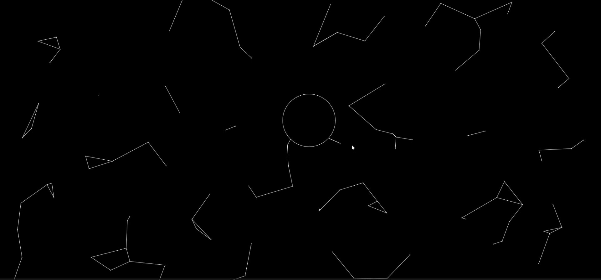
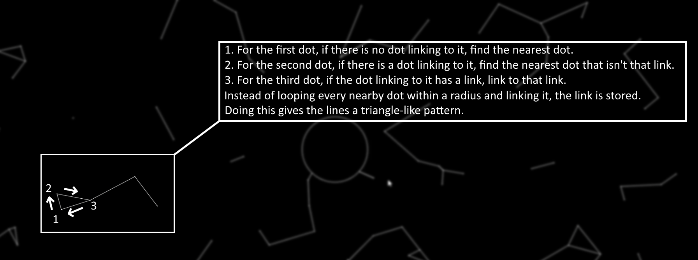

<h1>Connecting dots</h1>

With this being my first GitHub repo, I appreciate your interest in this project. Connecting dots uses p5js and p5play sprites for 2d physics. Connecting dots follows a known concept of connecting roaming dots on a screen to other nearby dots, forming patterns.
The mouse cursor is followed by a hollow circle that acts as a forcefield. This helps add an interactive user experience.

<h1>Screenshots</h1>

<h1>How it works</h1>

Instead of looping every nearby dot within a certain radius, to produce more triangle-like patterns, the links are instead stored in a variable to be used later.

